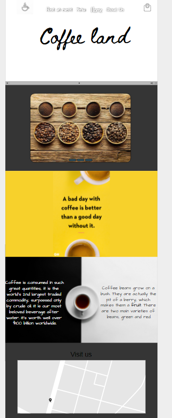
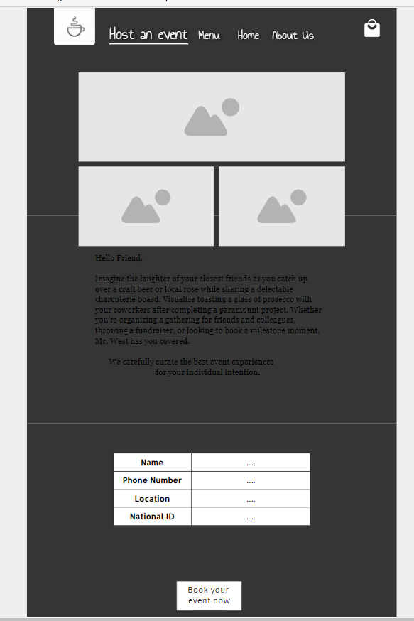
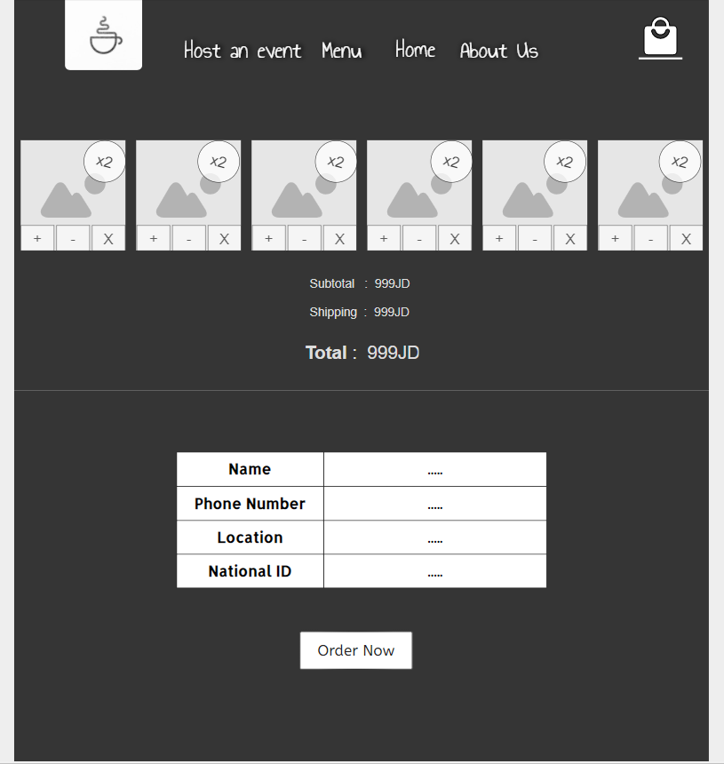

# Task1.1 
our website is a coffee shop website to sell hot drinks and cold drinks and beans coffee and snack  this website help customer to order coffee easily and he/ she doesn’t have to wait to order coffee and this website can deliver your order until your door and can pick up an event to do your event and user can order coffee or coffee beans faster and Cheaper Stake holder need some requirements for this website can user add new order and we add this Feature and can user order what he/she wants easily and faster and  add a good price for items and the user information will be safe can’t anybody to read it and make sure payment information will be safe and website have Usability and easy to use and easy to order. And add a map for locate our shop to help user to find our shop faster and easily. items and It is safe to use so this is our website we called it Coffee land.

#  Task 1.2
Risk
So, we have some risk
+  stakeholder change scope of website: maybe we work on the website and almost finish and stakeholder change scope that we done 
+ death stakeholder or death one of group who work on website: maybe death how told us to do this website or death one of the group members who have some of work
+ Exceeding the budget set by the steak holder:  Budget usage is higher than specified
+ didn’t make a clean code and low quality for code: didn’t use clean code and when you need to edit something you will not understand the code 
+ didn’t get the idea from user: when the stakeholder gives you the idea, I will not get what he/she wants
+ the user doesn’t like the website or the user don’t accept the website: when finish the website the stakeholder doesn’t like website or he need something else 
+ first time with group think this group will not work well: when you met groups for first time you will know personality for each member 
+ have a technical issue: maybe cut the internet or laptop  describe 

# Task1.3
## List of requirements
+ local storage for items 
+ view items 
+ add delivery item 
+ you can pick an event and fill the form 
+  add cart 
+ add menu for items 
+ add animation for website 
+ add fetcher that you can remove item and add item

## Database design and the wireframe

*Database design* we use local storage to save items information like name coffee(string), quantity(integer), type(string), price(integer) in local storage saves how much user order items and we save it and we can take it again. 
And save price total(integer) for item, subtotal(integer) and delivery price (integer)save in local storage

 *wireframe*
Home page here you can find map that you can know were our shop and have a nav bar contain menu, cart and Host an Event and cart. 

 
 
Menu page her we will have a section each section contains something 
Section cold coffee, section hot coffee, snacks and section for coffee beans 

Host an Event page this page you can pick an event in our shop and com with your friends

Cart page to put your choose item and total of your item and you can remove item 

 
About is page this page to show you how build this website 

## Activity Diagram

so here in activity diagram 

## Coding and implementation 
technique

 we use *Agile* technique 

So, the agile focuses on
certain characteristics, 
implemented in a short time and 
presented to the customer (the customer), here the customer (the customer) can see more how his idea was implemented, and we can see his reaction when seeing the product, if there are modifications or changes, it can be easily and quickly to do it, and then move to a next property until the project is fully built.
In general, the customer (the customer) cannot express his idea and exactly what he wants from the beginning, he has an idea, an explanation of his idea and how he imagines the software, but how to implement it and the characteristics he wants remains blurry until he sees a product with his own eyes, to be able to evaluate whether this is what he wants or not.
So, the Agile depends on providing real primary products during successive periods of time to the customer (the customer), which the customer (the customer) can try and evaluate and give the existing comments or errors, and therefore it is easy to overcome these errors or observations because you are in an early stage of work, and you can progress To the next step with greater steadfastness and completion of the next version by adding some features and characteristics until the project is completed.

[Resource]( https://www.atlassian.com/agile)
## Testing technique
 We will use black box technique 
#### I explant in stage 3

